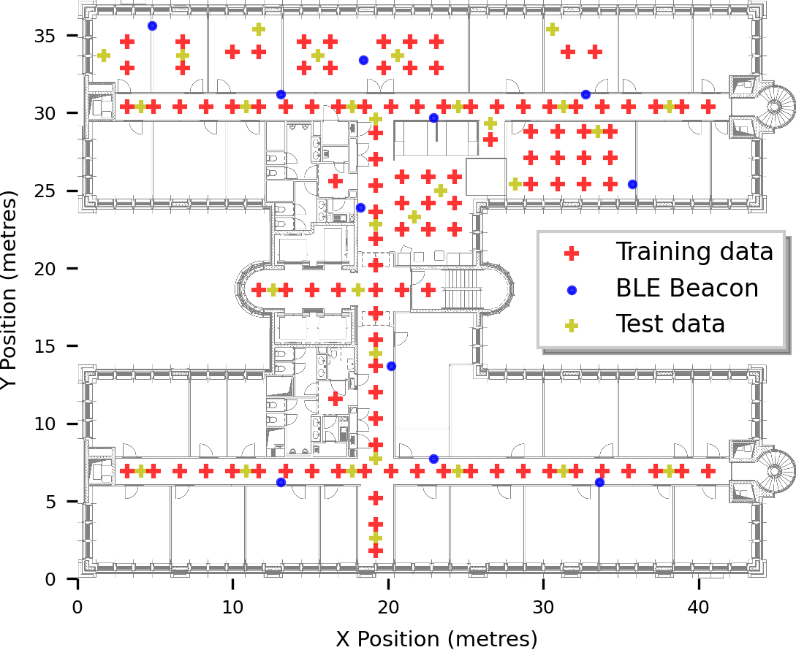

# OpenHPS: Single Floor Fingerprinting and Trajectory Dataset
**Version: 2021-05-09**

**Authors: *REDACTED FOR PAPER REVIEW***

## Description
This dataset contains fingerprint information of WLAN access points and BLE beacons with a known
position and IMU sensor data. Data was collected on the floor of the *REDACTED FOR PAPER REVIEW* with 110 training reference points and 30 test data points. Each reference point was recorded for 20 seconds in four different orientations. In this README document we go in depth into how the data was collected and the structure of the dataset.

## Collection
Data was collected using an Android application created using react-native, [OpenHPS](https://www.openhps.org) and [@openhps/react-native](https://github.com/OpenHPS/openhps-react-native) which includes a BLE, WLAN and IMU source.

|Parameter||
|-|-:|
|**Recording date**|2021-03-07 (Sunday)|
|**Device**|OnePlus 5T|
|**Android Version**|8.1.0|
|**Total BLE Beacons**|11|
|**Total detected WLAN access points**|220|
|**Total stable WLAN access points**|199|
|**Training datapoint duration**|20s (per orientation)|
|**Training datapoint orientations**|4|
|**Training datapoints**|110 (=440 fingerprints)|
|**Training WLAN data**|2653 (~6 scans per fingerprint)|
|**Training BLE advertisements**|7153 (~16 advertisements per fingerprint)|
|**Test datapoint duration**|20s (per orientation)|
|**Test datapoint orientations**|4|
|**Test datapoints**|30 (=120 fingerprints)|
|**Test WLAN data**|732 (~6 scans per fingerprint)|
|**Test BLE data**|1782 (~15 advertisements per fingerprint)|

Data was collected on a Sunday, limiting the amount of interference from other researchers in the lab (e.g. no change in open/closed doors, no personal Wi-Fi hotspots).

## Environment
For our dataset environment we used the floor of our research lab *REDACTED FOR PAPER REVIEW*.

The internal structure of the offices is created by using metal ferromagnetic walls. This causes several issues with the compass and direction obtained during the creation of the dataset and should be taken into account. Our accompanied floor plan (see misc directory) has its origin on the bottom left and retains the aspect ratio of the real indoor floor (46.275m * 37.27m).

## Data
### wlan_fingerprints
|Column|Description|Example|
|-|-|-|
|**TIMESTAMP**|Epoch timestamp (ms) when the data was collected|1614426288947|
|**X**|X position (min 0, max 44.33)|18.54|
|**Y**|Y position (min 0, max 37.27)|25.56|
|**ORIENTATION**|Orientation (degrees) relative to the top of the floor plan|90|
|[**WAP_***]|Wireless access point (numbered)|WAP_001|

### ble_fingerprints
|Column|Description|Example|
|-|-|-|
|**TIMESTAMP**|Epoch timestamp (ms) when the data was collected|1614426290136|
|**X**|X position (min 0, max 44.33)|18.54|
|**Y**|Y position (min 0, max 37.27)|25.56|
|**ORIENTATION**|Orientation (degrees) relative to the top of the floor plan|90|
|[**BEACON_***]|BLE iTAG beacon (numbered)|BEACON_01|

### ble_beacons
Each BLE beacon uses a generic iTAG device in their idle advertising state. Our capture device
detected an RSSI of -68 at 1 metre distance, which is used in the multilateration examples.

|Column|Description|Example|
|-|-|-|
|**ID**|Identifier of the beacon (used in fingerprint CSV files)|BEACON_01|
|**X**|X position (in metres)|12.59|
|**Y**|Y position (in metres)|31.16|
|**Z**|Z position (in metres)|1.6|

### wlan_aps
In the wireless access point dataset, individual access points are anonymised. However, we provide information such as the frequency (which indirectly also provides the channel), SSID group and a manual verification on whether or not this network is provided by the university.

|Column|Description|Example|
|-|-|-|
|**ID**|Wireless access point identifier in fingerprint CSV files (identified based on BSSID)|WAP_1|
|**FREQUENCY**|Broadcasting frequency (Hz)|2462|
|**SSID_ID**|Anonymised SSID identifier (used to group multiple BSSIDs with the same SSID)|1|
|**STABLE**|Manually verification if the SSID is a university access point (1=true, 0=false)|1|

*Note: An access point was considered stable if the SSID matched university, department or research lab access point SSIDs. This also includes public access points such as [eduroam](https://www.eduroam.org/).*

Unknown networks (with an unknown SSID) are removed from the processed training and test data, but
are still included in the raw datasets. These unknown SSIDs were identified as parked cars, printers,
mobile hotspots and IoT devices.

## Contents
- ```/wlan_aps.csv```: Wireless access point information
- ```/ble_devices.csv```: BLE beacon positions
- ```/misc```: Miscelanieous resources
    - ```/misc/floorplan.png```: PNG version of the floorplan
    - ```/misc/floorplan_medium.png```: PNG version of the floorplan (medium quality)
    - ```/misc/datapoints.svg```: Training and test data points visualisation
    - ```/misc/datapoints.csv```: Training data points CSV
    - ```/misc/testdatapoints.csv```: Test data points CSV
    - ```/misc/spaces.geo.json```: GeoJSON feature collection of symbolic spaces
    - ```/misc/documentation.css```: README documentation CSS (unrelated to the dataset)
- ```/train```: Training data points (110 in 4 orientations)
    - ```/train/raw```: Raw unprocessed data points (not aggregated)
        - ```/train/raw/wlan_fingerprints.csv```: Raw WLAN fingerprints
        - ```/train/raw/imu_fingerprints.csv```: Raw IMU data collection
        - ```/train/raw/ble_fingerprints.csv```: Raw BLE fingerprints
    - ```/train/aggregated```: Processed aggregated data points
        - ```/train/aggregated/wlan_fingerprints.csv```: WLAN fingerprints
        - ```/train/aggregated/ble_fingerprints.csv```: BLE fingerprints
        - ```/train/aggregated/imu_fingerprints.csv```: IMU data collection
        - ```/train/aggregated/wlan-ble_fingerprints.csv```: WLAN and BLE fingerprints merged
- ```/test```: Test data points (30 in 4 orientations)
    - ```/test/raw```: Raw unprocessed test data points (not aggregated)
        - ```/test/raw/wlan_fingerprints.csv```: Raw WLAN fingerprints
        - ```/test/raw/imu_fingerprints.csv```: Raw IMU data collection
        - ```/test/raw/ble_fingerprints.csv```: Raw BLE fingerprints
    - ```/test/aggregated```: Processed aggregated data points
        - ```/test/aggregated/wlan_fingerprints.csv```: WLAN fingerprints
        - ```/test/aggregated/ble_fingerprints.csv```: BLE fingerprints
        - ```/test/aggregated/imu_fingerprints.csv```: IMU data collection
        - ```/test/aggregated/wlan-ble_fingerprints.csv```: WLAN and BLE fingerprints merged
- ```/trajectories```: Test trajectories (10)
    - ```/trajectories/???```: Trajectory directory, ??? is the name of the trajectory
        - ```/trajectories/???/???_ble.csv```: BLE advertisements received during the trajectory
        - ```/trajectories/???/???_imu.csv```: IMU data from the trajectory
        - ```/trajectories/???/???_wlan.csv```: WLAN signals received during the trajectory

## License
Copyright (C) 2021 *REDACTED FOR PAPER REVIEW*

Licensed under the Apache License, Version 2.0 (the "License"); you may not use this file except in compliance with the License. You may obtain a copy of the License at

https://www.apache.org/licenses/LICENSE-2.0

Unless required by applicable law or agreed to in writing, software distributed under the License is distributed on an "AS IS" BASIS, WITHOUT WARRANTIES OR CONDITIONS OF ANY KIND, either express or implied. See the License for the specific language governing permissions and limitations under the License.